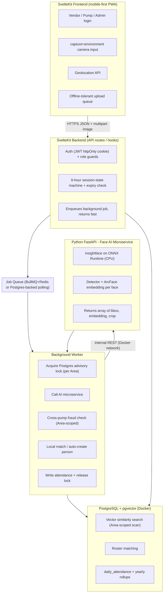
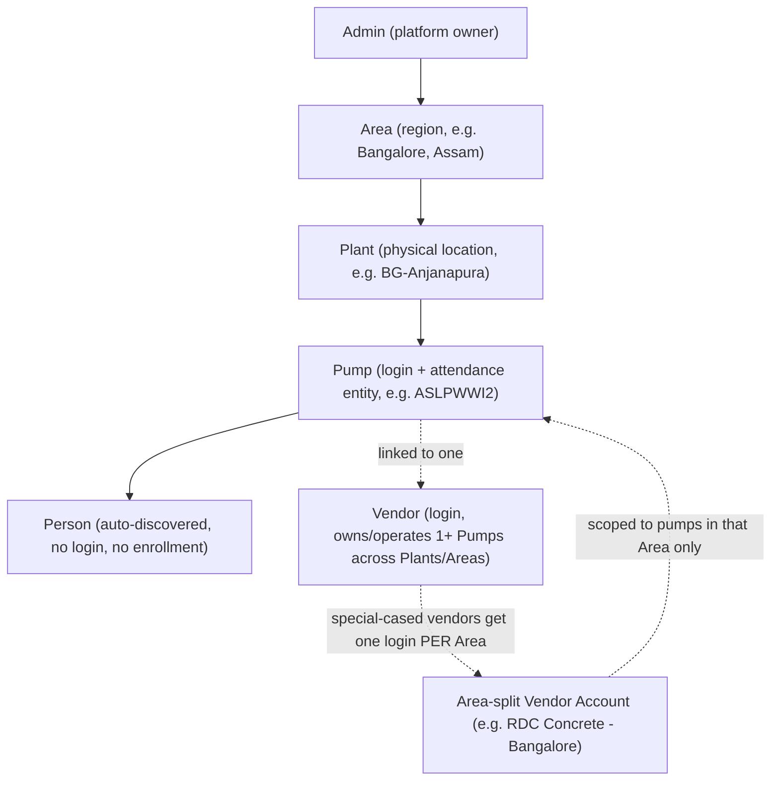
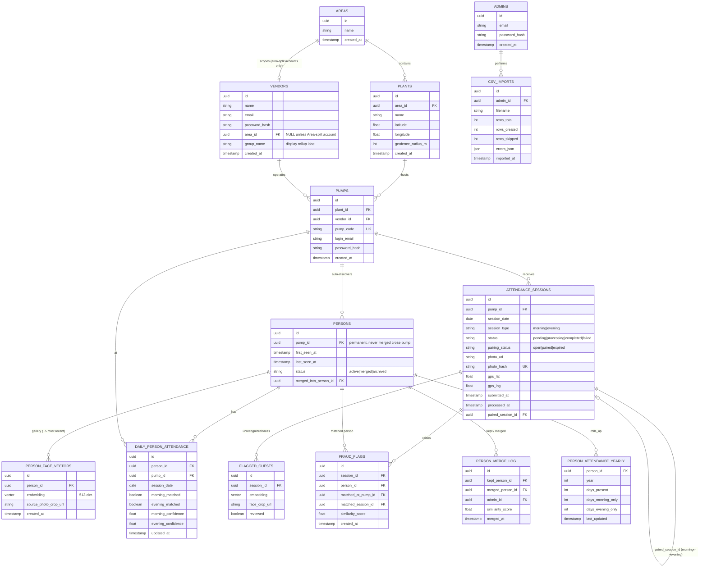
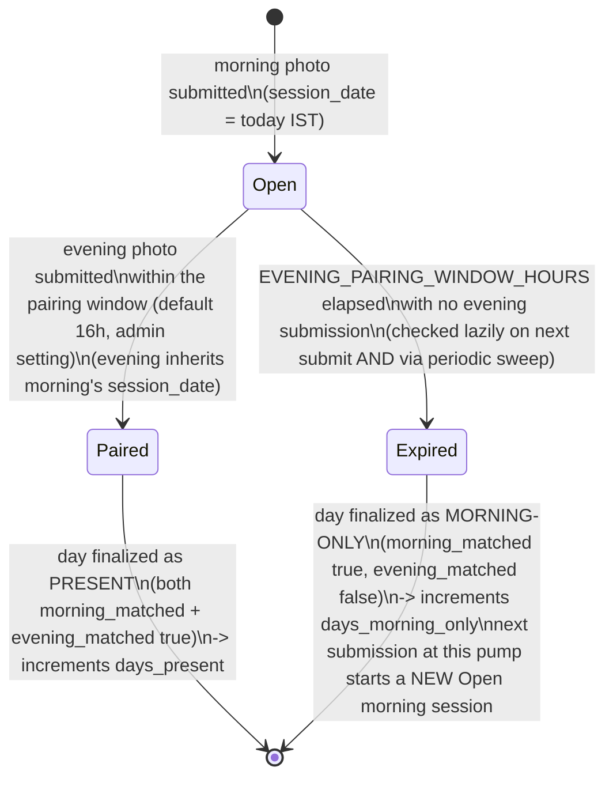
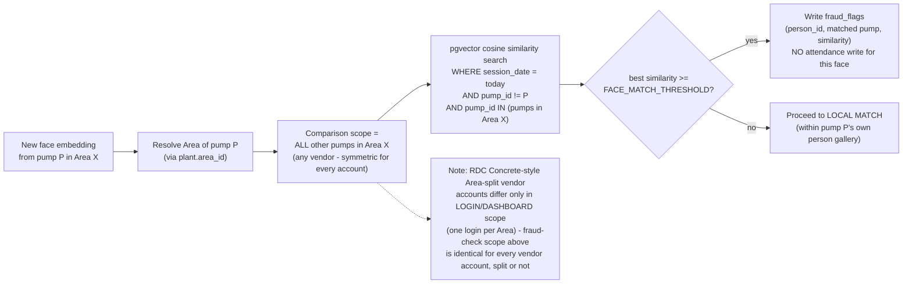
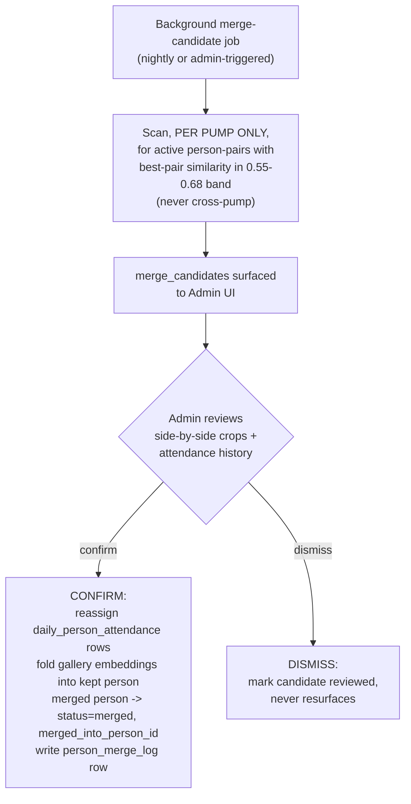
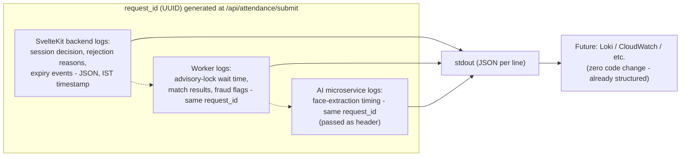
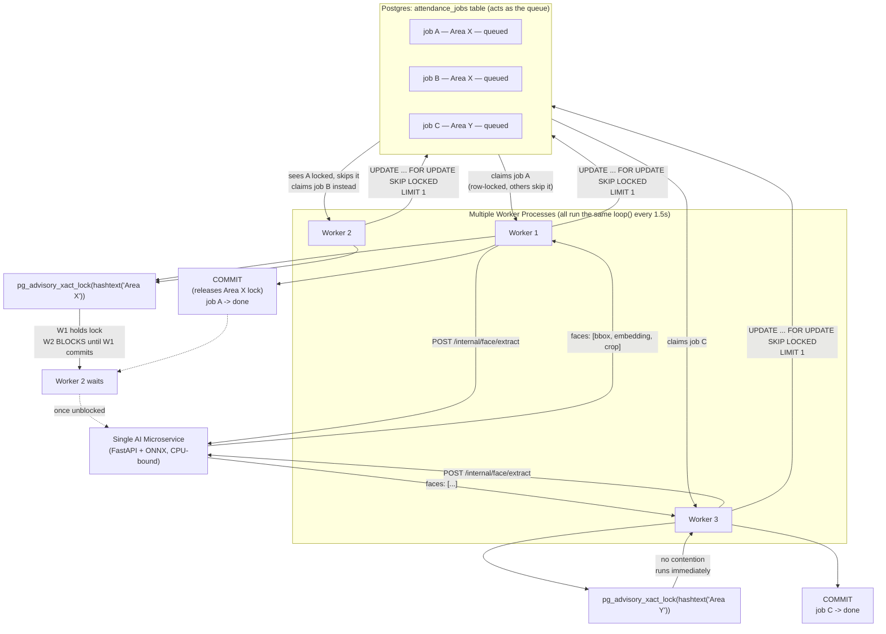

# Architecture

## 1. System Architecture



## 2. Entity Hierarchy



## 3. Entity-Relationship Diagram (Data Model)



## 4. Attendance Submission Flow (Synchronous + Asynchronous)

```mermaid
sequenceDiagram
    participant Pump as Pump (frontend)
    participant API as SvelteKit Backend
    participant Q as Job Queue
    participant W as Background Worker
    participant AI as FastAPI AI Microservice
    participant DB as Postgres + pgvector

    Pump->>API: POST /api/attendance/submit (photo, gps)
    activate API
    API->>API: Compute "today" in IST explicitly
    API->>DB: Expire stale open morning sessions (> EVENING_PAIRING_WINDOW_HOURS)
    API->>DB: Find most recent OPEN morning session for this pump
    alt no open morning session
        API->>API: session_type = morning, session_date = today (IST)
    else open morning session exists
        API->>API: compute elapsed hours vs morning.submitted_at
        alt elapsed < 9 hours
            API-->>Pump: 409 "9-hour rule: X hours remaining"
        else elapsed >= 9 hours
            API->>API: session_type = evening, session_date = COPIED from morning
        end
    else no open/expired morning AND today already complete
        API-->>Pump: 409 "day complete"
    end
    API->>DB: Hash photo (sha256); reject if photo_hash exists (idempotency)
    API->>DB: INSERT attendance_sessions (status=pending, paired_session_id if evening)
    API->>Q: enqueue job(session_id, request_id)
    API-->>Pump: 202 { session_id, status: pending }
    deactivate API

    Pump->>API: GET /api/attendance/status/:session_id (poll every ~2s)

    Q->>W: deliver job
    activate W
    W->>DB: pg_advisory_xact_lock(area_id)
    Note over W,DB: Blocks if another session in same Area is mid-processing
    W->>DB: mark session status=processing
    W->>AI: POST /internal/face/extract (image, request_id header)
    activate AI
    AI-->>W: [{ bbox, embedding[512], crop_base64 }, ...]
    deactivate AI

    loop for each detected face
        W->>DB: CROSS-PUMP CHECK - cosine similarity vs other pumps in SAME AREA (symmetric, any vendor)
        alt match >= FACE_MATCH_THRESHOLD in Area
            W->>DB: INSERT fraud_flags (person_id, matched_pump, similarity)
            Note over W: face skipped, no attendance write, continue to next face
        else no cross-pump match
            W->>DB: LOCAL MATCH - best similarity vs this pump's person gallery
            alt match >= FACE_MATCH_THRESHOLD at this pump
                W->>DB: upsert daily_person_attendance (morning_matched or evening_matched = true)
                W->>DB: append embedding to gallery (drop oldest beyond ~5)
            else no match anywhere
                W->>DB: AUTO-CREATE new persons row + first gallery embedding
                W->>DB: create daily_person_attendance row for this session_date
            end
        end
    end

    W->>DB: mark session status=completed, processed_at=now()
    alt this was an EVENING session
        W->>DB: upsert person_attendance_yearly (days_present / days_morning_only / days_evening_only)
    end
    W->>DB: COMMIT (releases advisory lock)
    deactivate W

    Pump->>API: GET /api/attendance/status/:session_id
    API-->>Pump: { status: completed, matched[], new_persons[], fraud_flags[] }
```

## 5. Session Pairing State Machine



## 6. Cross-Pump Fraud Check Scope



## 7. Merge Candidate Review Flow (Same-Pump Only)



## 8. Structured Logging & Request Correlation



## 9. Worker Job Claiming & Per-Area Locking

There is no message broker (Redis/BullMQ) in the current implementation — `attendance_jobs` is a plain Postgres table acting as the queue. Every worker process runs the same poll loop every `POLL_INTERVAL_MS` (1.5s). Concurrency safety comes from two separate Postgres mechanisms: `FOR UPDATE SKIP LOCKED` for claiming jobs, and (as of the optimistic-concurrency change below) `SERIALIZABLE` transaction isolation for the matching/write phase.

> **Update (2026-09-03): the per-Area blocking lock described in the diagrams below has been replaced.**
> `worker/index.js`'s `processJob()` no longer takes `pg_advisory_xact_lock(hashtext(area_id))` before matching. Instead:
> - AI extraction now happens *before* any transaction is opened at all (it needs no exclusivity), so multiple jobs' extraction calls run fully concurrently regardless of Area.
> - The matching + fraud-check + write step runs inside a single `BEGIN ISOLATION LEVEL SERIALIZABLE` transaction, with no lock acquired. Two jobs in the same Area (even the same `session_date`) can now enter this phase at the same time — nothing blocks them.
> - Postgres's Serializable Snapshot Isolation (SSI) tracks what each concurrent transaction actually reads and writes, and aborts one with a `serialization_failure` (SQLSTATE `40001`, or `40P01` for a plain deadlock) if committing both would be impossible under any one-at-a-time ordering — i.e. it catches exactly the same cross-pump race the old lock prevented by blocking, just after the fact instead of before it.
> - On that error, `processJob()` retries the whole matching/write phase from scratch (up to `SERIALIZATION_RETRY_LIMIT`, default 5) — cheap, since only the DB-only phase repeats, not the AI call. Retries exhausted falls through to the normal job-attempt retry (`MAX_JOB_ATTEMPTS`).
> - This also subsumes the finer-grained idea of scoping a lock key by `(area_id, session_date)`: SSI's conflict detection is already scoped to whatever rows a transaction actually touched (which includes `session_date` via the existing query filters), so it's strictly more precise than any hand-picked lock key — two jobs that don't actually read/write overlapping rows never conflict at all, Area or date not withstanding.
>
> The diagrams and prose immediately below describe the **previous** (blocking-lock) design; they're kept as-is because the *shape* of the problem (per-Area contention under burst load) and the claiming mechanism (`SKIP LOCKED`) are unchanged — only the concurrency-control strategy for the matching/write step changed, from pessimistic (block) to optimistic (detect-and-retry).



Same-Area contention in sequence form — two workers claiming different jobs but the same Area serialize at the lock, not at the claim:

```mermaid
sequenceDiagram
    participant W1 as Worker 1
    participant W2 as Worker 2
    participant PG as Postgres
    participant AI as AI Microservice

    par Both poll at once
        W1->>PG: claimNextJob() — SKIP LOCKED
        W2->>PG: claimNextJob() — SKIP LOCKED
    end
    PG-->>W1: job A (Area X)
    PG-->>W2: job B (Area X)

    W1->>PG: BEGIN; pg_advisory_xact_lock(Area X)
    Note over PG: lock acquired by W1

    W2->>PG: BEGIN; pg_advisory_xact_lock(Area X)
    Note over W2,PG: W2 BLOCKS here — same Area lock held by W1

    W1->>AI: POST /internal/face/extract
    AI-->>W1: embeddings

    W1->>PG: fraud check + local match + writes
    W1->>PG: COMMIT
    Note over PG: lock released

    Note over W2,PG: W2 unblocks, acquires lock
    W2->>AI: POST /internal/face/extract
    AI-->>W2: embeddings
    W2->>PG: fraud check + local match + writes
    W2->>PG: COMMIT
```

**Scaling notes:**
- Claiming jobs is fully parallel — `SKIP LOCKED` hands different rows to different workers with no coordination overhead.
- Processing jobs from the *same* Area is serialized by the advisory lock; processing jobs from *different* Areas runs fully concurrently.
- The current `docker-compose.yml` runs a single `worker` replica with no `replicas:` count set, but the claiming logic already supports `docker compose up --scale worker=N` safely today.
- The AI microservice is a single CPU-bound container shared by every worker — it, not the worker count, is the real throughput ceiling until it is scaled out too.
- Stale/crashed jobs (`status='claimed'` past `JOB_CLAIM_TIMEOUT_MINUTES`) are automatically re-claimable by any worker, up to `MAX_JOB_ATTEMPTS`.
