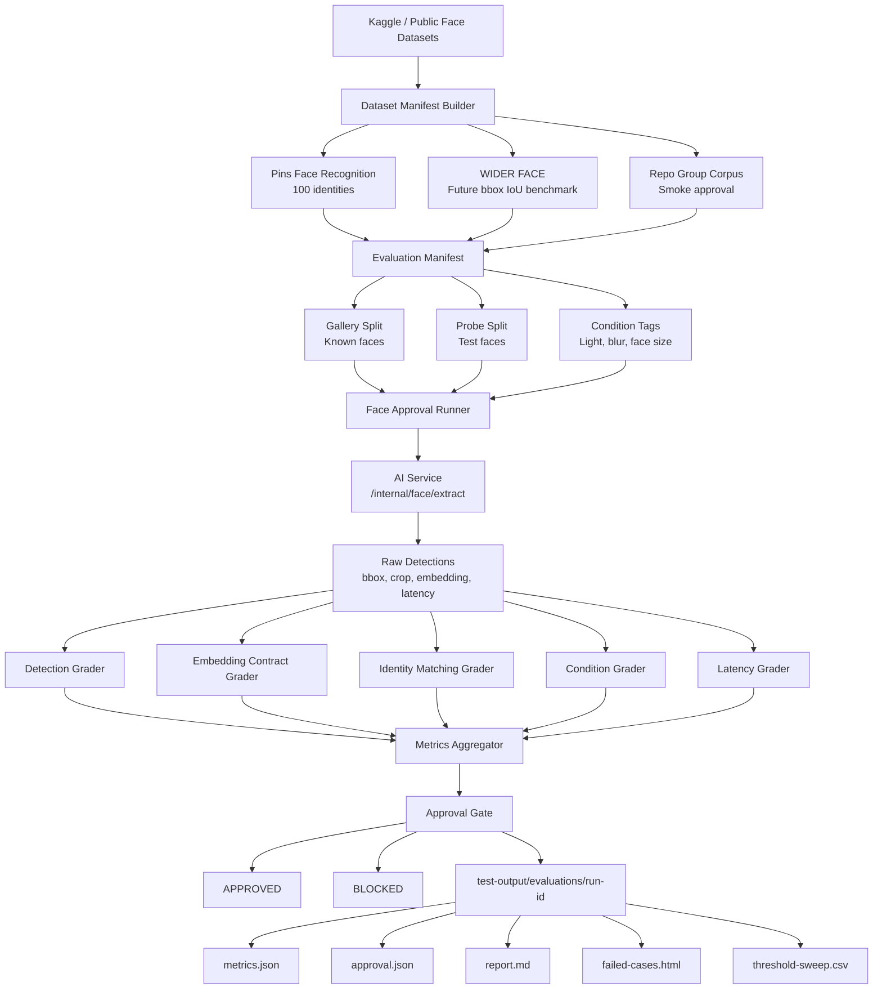

# Face Attendance Evaluation Approval System

## Objective

Build a reusable approval system that answers:

- How accurate is the face attendance system across 100 users?
- Which component is weak: detection, embeddings, matching, attendance logic, latency, or reliability?
- Should the current build be approved after a model, threshold, worker, or UI change?

The approval system is dataset-driven. It should be run before accepting changes to:

- face detection model
- embedding model
- match threshold
- worker matching logic
- attendance retry/review flow
- API performance or queue behavior

## Recommended Dataset Strategy

### First Benchmark: Pins Face Recognition

Use Kaggle `hereisburak/pins-face-recognition` as the first 100-person benchmark.

Reason:

- It has more than 100 identities.
- It has multiple photos per identity.
- It fits the first goal: "100 users, different photos, different conditions."

Local expected folder:

```text
datasets/pins/
  105_classes_pins_dataset/
    pins_Aaron Paul/
      image1.jpg
      image2.jpg
```

The raw dataset is ignored by git because it contains biometric data.

### Detection Benchmark: WIDER FACE

Use WIDER FACE for true bounding-box IoU scoring after the labeled train/validation split and
annotation files are available. The Kaggle mirror currently registered by `eval:download:core`
downloads the unlabeled WIDER test image split, so it proves dataset access but is not enough for a
real bbox approval gate.

## Approval Commands

Download/register the core datasets:

```powershell
npm run eval:download:core
```

Build a deterministic 100-identity manifest:

```powershell
npm run eval:manifest:pins
```

Build manifests from the local KaggleHub registry instead of a copied `datasets/pins` folder:

```powershell
npm run eval:manifest:pins:local
npm run eval:manifest:lfw:local
npm run eval:manifest:wider:local
```

Run fast smoke approval against a 4-photo sample of the checked-in group-photo corpus:

```powershell
npm run eval:faces:smoke
```

Run the smaller LFW sanity benchmark:

```powershell
npm run eval:faces:lfw
```

Run the WIDER bbox smoke benchmark:

```powershell
npm run eval:faces:wider
```

Run full 100-identity accuracy evaluation:

```powershell
npm run eval:faces
```

Run full blocking approval gate:

```powershell
npm run eval:approve
```

`eval:approve` exits with code `1` if any approval gate fails. The smoke command also uses `--require-approval`, but it intentionally samples only 4 photos so it stays fast on CPU. To run all 20 group-corpus photos manually, call `python scripts/run-face-approval-eval.py --manifest tests/fixtures/group-e2e/manifest.json --config eval/face-approval.smoke.json --limit-photos 20`.

## Output Location

Each run writes:

```text
test-output/evaluations/<run-id>/
  ai-health.json
  manifest-used.json
  approval-config-used.json
  metrics.json
  approval.json
  approval-gates.csv
  report.md
  failed-cases.html
  failed-cases.json
  extractions.csv
  probe-predictions.csv
  condition-metrics.csv
  threshold-sweep.csv
  wider-detection-summary.csv
```

This directory is ignored by git because it can contain biometric metadata and local paths.

The dataset registry is written to:

```text
eval/datasets.local.json
```

That registry is also ignored by git because it stores local cache paths.

## Metrics

### Dataset Metrics

- identities
- gallery images
- probe images
- failed images

### Face Detection Metrics

- detection success rate
- visible-face recall for group-photo smoke tests
- bbox precision, bbox recall, bbox F1, exact count accuracy, and count MAE for WIDER FACE
- failed image count

### Embedding Contract Metrics

- embedding dimension validity
- finite value validity
- bounding-box validity
- contract error rate

### Face Matching Metrics

- top-1 accuracy
- top-5 accuracy
- verified top-1 accuracy at threshold
- false accept rate
- false reject rate
- equal error rate
- threshold sweep

### Condition Metrics

The evaluator tags images with computed quality groups:

- low light / normal light / bright light
- soft_or_blur / sharp
- small_face / medium_face / large_face

Each condition gets its own accuracy row.

### Latency Metrics

- mean AI processing time
- p95 AI processing time
- max AI processing time

## Default Full Approval Gates

Stored in:

```text
eval/face-approval.full.json
```

Current gates:

- at least 100 identities
- at least 500 gallery images
- at least 1000 probe images
- detection success rate >= 95%
- embedding contract error rate = 0
- top-1 accuracy >= 90%
- verified top-1 accuracy >= 85%
- false accept rate <= 1%
- false reject rate <= 10%
- equal error rate <= 8%
- p95 processing time <= 2500 ms
- failed images = 0

These gates are intentionally strict. If they are too high for the current model, do not hide the
failure. Record the baseline and then tune thresholds or improve the model.

## Mermaid Architecture



## Release Workflow

1. Run `npm run eval:faces:smoke` before quick local changes.
2. Run `npm run eval:approve` before accepting model or threshold changes.
3. Compare `metrics.json` against the previous approved run.
4. If blocked, inspect `failed-cases.html`, `condition-metrics.csv`, and `threshold-sweep.csv`.
5. Only approve changes when the gate passes or when a human explicitly accepts a documented metric tradeoff.
